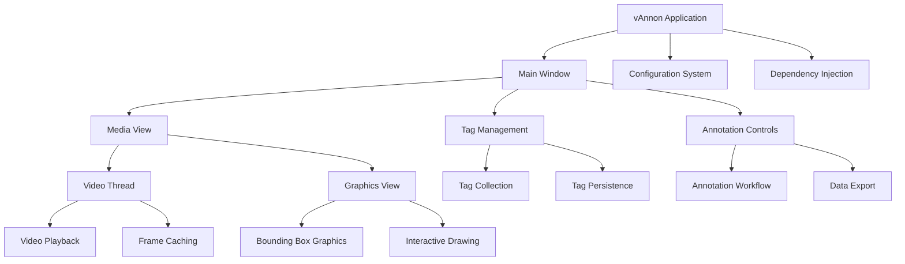
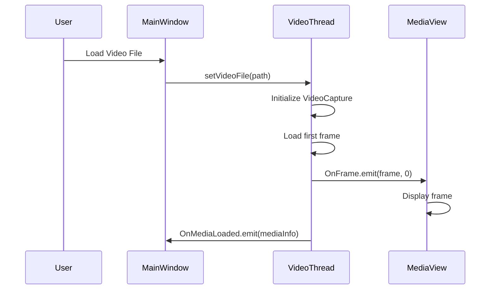
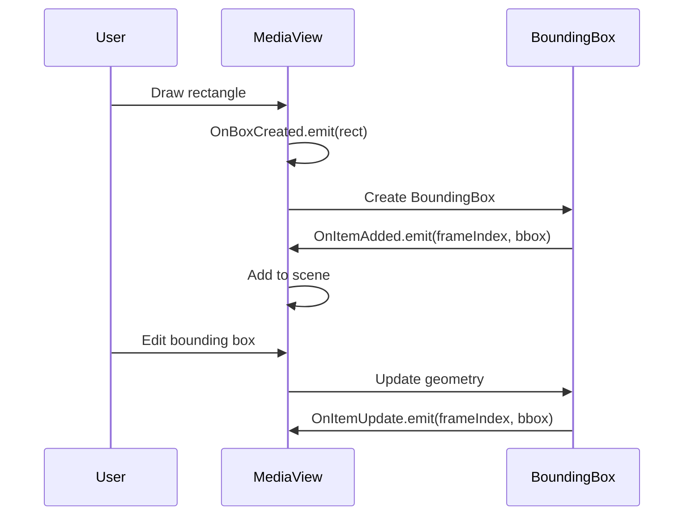

# vAnnon System Architecture

## High-Level Architecture



## Core Components

### 1. Application Entry Point (`main.py`)
- **Purpose**: Initializes the application, sets up dependency injection, loads configuration
- **Responsibilities**:
  - Taskbar icon configuration (Windows)
  - QApplication setup
  - Font and QSS loading
  - Main window instantiation

### 2. Configuration System (`configuration/`)
- **vAnnonConfiguration**: Extends ApplicationConfiguration
- **Features**:
  - Tags path management
  - Logger configuration
  - Style and UI settings
  - Image paths and extensions

### 3. Video Processing Layer (`videoThread/`)

#### VideoThread
- **Inherits from**: Streamer (base streaming functionality)
- **Key Features**:
  - Video file loading and playback
  - Frame-by-frame navigation
  - Seek operations with caching
  - Playback state management (PLAYING, PAUSED, STOPPED, FAST, FORWARD, BACKWARD)

#### Playback States
```python
class ePlaybackState(IntFlag):
    STOPPED = 0x00
    PLAYING = 0x01
    PAUSED = 0x02
    FAST = 0x04
    FORWARD = PLAYING | 0x08
    BACKWARD = PLAYING | 0x10
```

#### Caching System
- **Purpose**: Improve seek performance by caching frames
- **Features**:
  - Configurable cache duration
  - Priority-based caching (forward/backward direction aware)
  - Automatic cache management
  - Performance monitoring (seek/read times)

### 4. Annotation System

#### Tag System (`tags/`)
- **Tag**: Basic annotation class with Code, Text, Description
- **TagCollection**: Manages collection of tags with persistence
- **Features**:
  - Unique code enforcement (power-of-2 values)
  - Text uniqueness validation
  - JSON serialization
  - Search and filtering capabilities

#### Bounding Box System (`boundingbox/`)
- **BoundingBox**: QRectF-based annotation with metadata
- **Features**:
  - UUID-based identification
  - Class/label assignment
  - Origin tracking
  - Serialization support

### 5. User Interface Layer (`UI/`)

#### Main Window
- **Inherits from**: ModernWindow (jAGUI)
- **Layout**: Vertical QBoxLayout with stretch
- **Features**: Close event handling, UI setup hooks

#### Media View (`UI/components/`)
- **GraphicsView**: Custom QGraphicsView for video display
- **MediaView**: Extends GraphicsView with annotation capabilities
- **Features**:
  - Interactive bounding box drawing
  - Frame-based annotation management
  - Keyboard shortcuts (Delete, Copy/Paste)
  - Real-time visual feedback

### 6. Data Flow

#### Video Loading Workflow


#### Annotation Workflow


## Dependencies

### Core Dependencies
- **PySide6**: Qt-based UI framework
- **OpenCV**: Video processing and computer vision
- **NumPy**: Numerical computing for frame data

### Framework Dependencies
- **jAGFx**: Custom framework for configuration, logging, DI, serialization
- **jAGUI**: UI component library
- **Streamer**: Base streaming functionality

### External Libraries
- **cv2 (OpenCV)**: Video capture and frame processing
- **numpy**: Array operations for image data
- **json**: Configuration and data persistence
- **uuid**: Unique identifier generation

## Design Patterns

### Object-Oriented Design
- **Inheritance**: Extensive use of inheritance (VideoThread -> Streamer, MainWindow -> ModernWindow)
- **Composition**: Components composed of smaller, focused classes
- **Interfaces**: Protocol-based contracts (iTag, iVideoThread)

### Design Patterns Applied
- **Dependency Injection**: Provider pattern for service resolution
- **Observer Pattern**: Signal/slot mechanism for event handling
- **Factory Pattern**: Configuration loading and object creation
- **Singleton**: Application-wide services and configuration
- **Decorator**: Process markers and benchmarking

### Threading and Concurrency
- **Threading**: VideoThread runs in separate thread for smooth playback
- **RLock**: Thread-safe operations on shared resources
- **Daemon Threads**: Cache management runs in background

## Configuration Management

### Configuration Sources
- **JSON Files**: `config/vannon/appconfig.json`
- **Environment Variables**: Path resolution and platform-specific settings
- **Runtime Configuration**: Dynamic settings through dependency injection

### Configuration Structure
```json
{
  "Title": "jAG's Video Annotator",
  "Company": "jAG",
  "AppId": "vAnnon",
  "TagsPath": ".\\assets\\tags\\tags.json",
  "Style": "base",
  "Sections": {
    "LOGGER": { ... }
  }
}
```

## Data Persistence

### Serialization Strategy
- **JSON-based**: All core objects implement Serialisable interface
- **Type Metadata**: `__type__` field for deserialization
- **Property Reflection**: Automatic property encoding/decoding

### Storage Locations
- **Tags**: `assets/tags/tags.json`
- **Configuration**: `config/vannon/appconfig.json`
- **Assets**: `assets/` directory (icons, images)

## Error Handling and Logging

### Logging Strategy
- **Centralized Logger**: jAGFx logger with multiple levels
- **Configuration-driven**: Log levels set via config
- **Context-aware**: Caller information and timestamps

### Error Handling
- **Try/Except Blocks**: Comprehensive exception handling
- **Graceful Degradation**: Continue operation when possible
- **User Feedback**: Error messages and status updates

## Performance Considerations

### Video Processing
- **Frame Caching**: Reduces seek latency
- **Asynchronous Loading**: Non-blocking UI during video operations
- **Memory Management**: Efficient frame storage and cleanup

### UI Responsiveness
- **Thread Separation**: Video processing off main thread
- **Lazy Loading**: Components loaded on demand
- **Efficient Rendering**: Optimized graphics updates

## Extensibility

### Plugin Architecture
- **Modular Design**: Components can be extended or replaced
- **Interface-based**: Contracts allow for alternative implementations
- **Configuration-driven**: Behavior modified through config changes

### Future Enhancements
- **Automated Annotation**: Integration with ML models
- **Batch Processing**: Multiple video annotation workflows
- **Collaboration**: Multi-user annotation support
- **Advanced Tools**: Polygon annotations, keypoint detection
