# vAnnon System Diagrams

## Architecture Overview

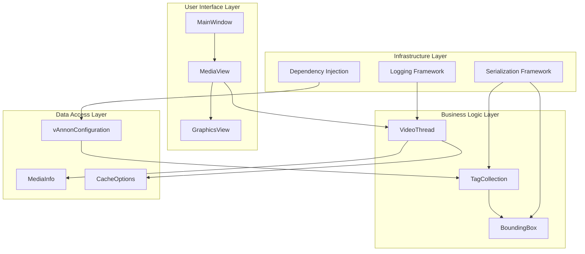
```mermaid
graph TB
    subgraph "User Interface Layer"
        MW[MainWindow]
        MV[MediaView]
        GV[GraphicsView]
    end

    subgraph "Business Logic Layer"
        VT[VideoThread]
        TC[TagCollection]
        BB[BoundingBox]
    end

    subgraph "Data Access Layer"
        MI[MediaInfo]
        CO[CacheOptions]
        CFG[vAnnonConfiguration]
    end

    subgraph "Infrastructure Layer"
        DI[Dependency Injection]
        LOG[Logging Framework]
        SER[Serialization Framework]
    end

    MW --> MV
    MV --> GV
    MV --> VT
    VT --> MI
    VT --> CO
    TC --> BB
    CFG --> TC
    DI --> CFG
    LOG --> VT
    SER --> TC
    SER --> BB
```

## Component Relationships

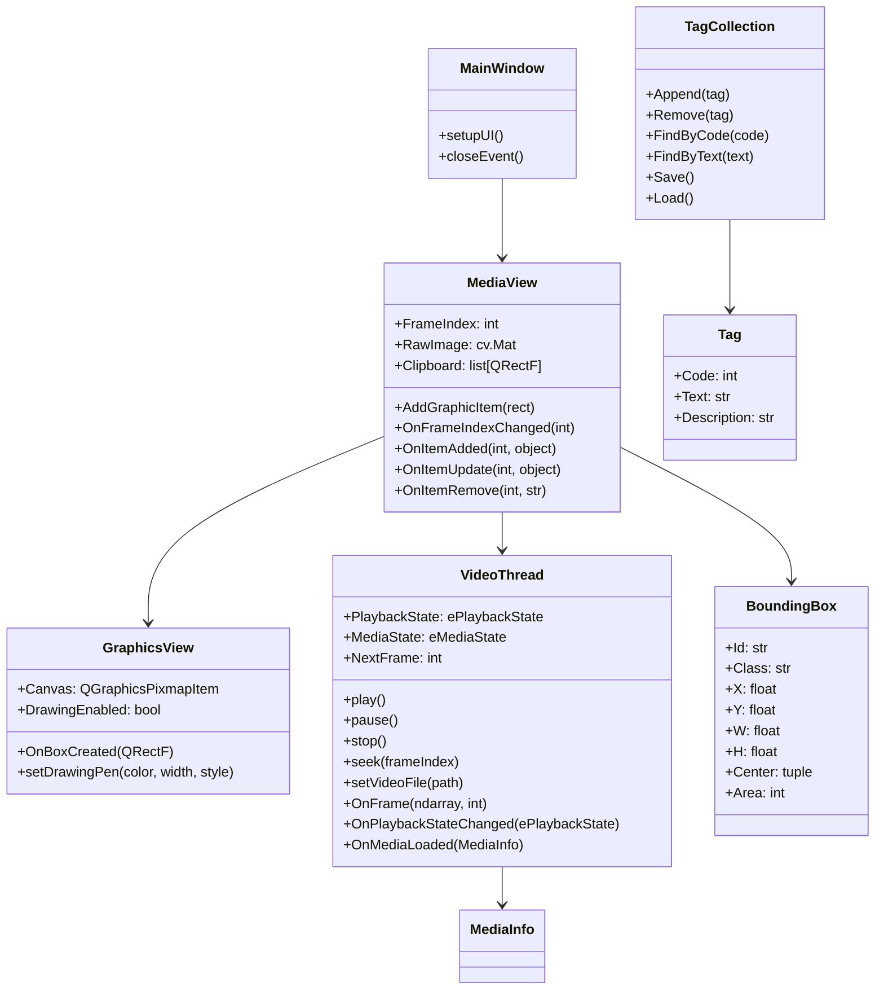
```mermaid
classDiagram
    class MainWindow {
        +setupUI()
        +closeEvent()
    }

    class MediaView {
        +FrameIndex: int
        +RawImage: cv.Mat
        +Clipboard: list[QRectF]
        +AddGraphicItem(rect)
        +OnFrameIndexChanged(int)
        +OnItemAdded(int, object)
        +OnItemUpdate(int, object)
        +OnItemRemove(int, str)
    }

    class GraphicsView {
        +Canvas: QGraphicsPixmapItem
        +DrawingEnabled: bool
        +OnBoxCreated(QRectF)
        +setDrawingPen(color, width, style)
    }

    class VideoThread {
        +PlaybackState: ePlaybackState
        +MediaState: eMediaState
        +NextFrame: int
        +play()
        +pause()
        +stop()
        +seek(frameIndex)
        +setVideoFile(path)
        +OnFrame(ndarray, int)
        +OnPlaybackStateChanged(ePlaybackState)
        +OnMediaLoaded(MediaInfo)
    }

    class TagCollection {
        +Append(tag)
        +Remove(tag)
        +FindByCode(code)
        +FindByText(text)
        +Save()
        +Load()
    }

    class Tag {
        +Code: int
        +Text: str
        +Description: str
    }

    class BoundingBox {
        +Id: str
        +Class: str
        +X: float
        +Y: float
        +W: float
        +H: float
        +Center: tuple
        +Area: int
    }

    MainWindow --> MediaView
    MediaView --> GraphicsView
    MediaView --> VideoThread
    VideoThread --> MediaInfo
    TagCollection --> Tag
    MediaView --> BoundingBox
```

## Data Flow Diagrams

### Video Loading Sequence

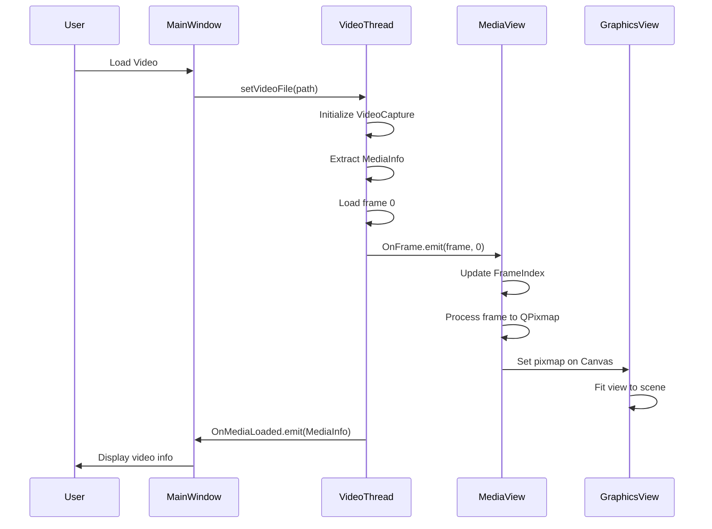
```mermaid
sequenceDiagram
    participant U as User
    participant MW as MainWindow
    participant VT as VideoThread
    participant MV as MediaView
    participant GV as GraphicsView

    U->>MW: Load Video
    MW->>VT: setVideoFile(path)
    VT->>VT: Initialize VideoCapture
    VT->>VT: Extract MediaInfo
    VT->>VT: Load frame 0
    VT->>MV: OnFrame.emit(frame, 0)
    MV->>MV: Update FrameIndex
    MV->>MV: Process frame to QPixmap
    MV->>GV: Set pixmap on Canvas
    GV->>GV: Fit view to scene
    VT->>MW: OnMediaLoaded.emit(MediaInfo)
    MW->>U: Display video info
```

### Annotation Creation Sequence

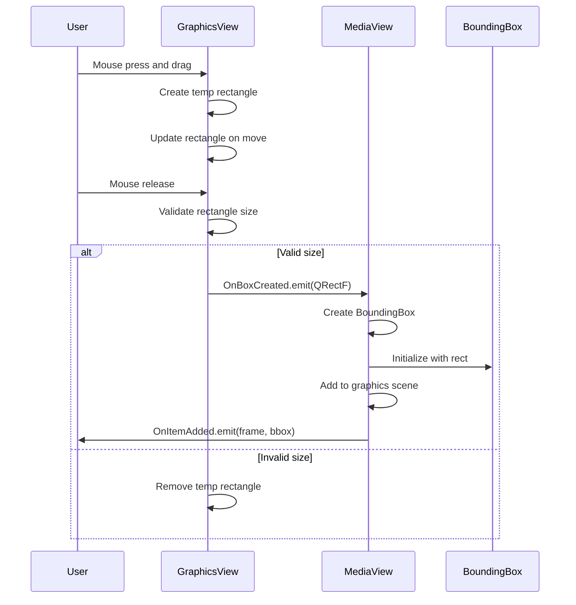
```mermaid
sequenceDiagram
    participant U as User
    participant GV as GraphicsView
    participant MV as MediaView
    participant BB as BoundingBox

    U->>GV: Mouse press and drag
    GV->>GV: Create temp rectangle
    GV->>GV: Update rectangle on move
    U->>GV: Mouse release
    GV->>GV: Validate rectangle size
    alt Valid size
        GV->>MV: OnBoxCreated.emit(QRectF)
        MV->>MV: Create BoundingBox
        MV->>BB: Initialize with rect
        MV->>MV: Add to graphics scene
        MV->>U: OnItemAdded.emit(frame, bbox)
    else Invalid size
        GV->>GV: Remove temp rectangle
    end
```

### Playback Control Flow

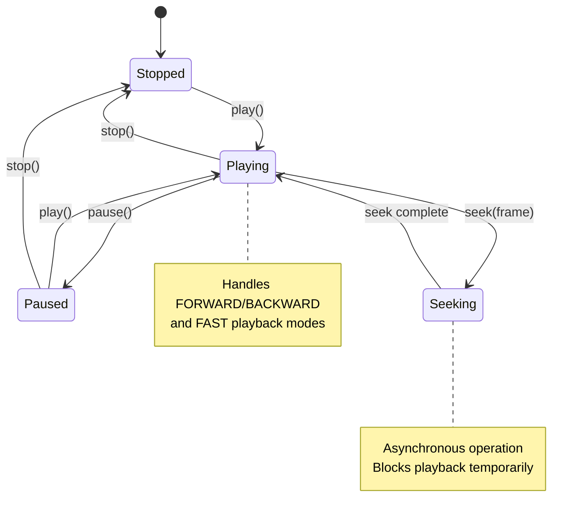
```mermaid
stateDiagram-v2
    [*] --> Stopped
    Stopped --> Playing: play()
    Playing --> Paused: pause()
    Paused --> Playing: play()
    Playing --> Stopped: stop()
    Paused --> Stopped: stop()
    Playing --> Seeking: seek(frame)
    Seeking --> Playing: seek complete

    note right of Playing
        Handles FORWARD/BACKWARD
        and FAST playback modes
    end note

    note right of Seeking
        Asynchronous operation
        Blocks playback temporarily
    end note
```

## Tag System Architecture

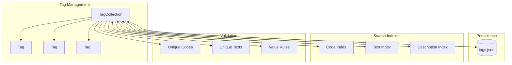
```mermaid
graph TD
    subgraph "Tag Management"
        TC[TagCollection] --> T1[Tag]
        TC --> T2[Tag]
        TC --> Tn[Tag...]
    end

    subgraph "Persistence"
        TC --> JSON[(tags.json)]
    end

    subgraph "Search Indexes"
        TC --> IC[Code Index]
        TC --> IT[Text Index]
        TC --> ID[Description Index]
    end

    subgraph "Validation"
        TC --> UC[Unique Codes]
        TC --> UT[Unique Texts]
        TC --> VR[Value Rules]
    end

    JSON --> TC
    IC --> TC
    IT --> TC
    ID --> TC
```

## Video Processing Pipeline

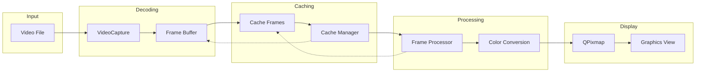
```mermaid
graph LR
    subgraph "Input"
        VF[Video File]
    end

    subgraph "Decoding"
        VC[VideoCapture]
        FB[Frame Buffer]
    end

    subgraph "Caching"
        CF[Cache Frames]
        CM[Cache Manager]
    end

    subgraph "Processing"
        FP[Frame Processor]
        CV[Color Conversion]
    end

    subgraph "Display"
        PX[QPixmap]
        GV[Graphics View]
    end

    VF --> VC
    VC --> FB
    FB --> CF
    CF --> CM
    CM --> FP
    FP --> CV
    CV --> PX
    PX --> GV

    CM -.-> FB
    FP -.-> CF
```

## Configuration System

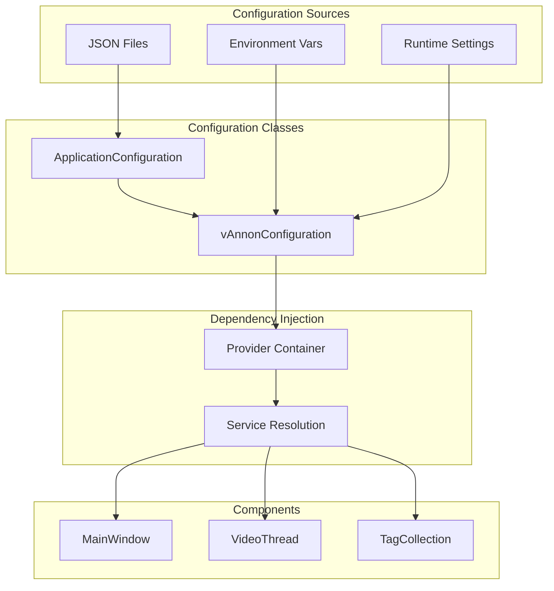
```mermaid
graph TD
    subgraph "Configuration Sources"
        JF[JSON Files]
        EV[Environment Vars]
        RT[Runtime Settings]
    end

    subgraph "Configuration Classes"
        AC[ApplicationConfiguration]
        VC[vAnnonConfiguration]
    end

    subgraph "Dependency Injection"
        DI[Provider Container]
        SR[Service Resolution]
    end

    subgraph "Components"
        MW[MainWindow]
        VT[VideoThread]
        TC[TagCollection]
    end

    JF --> AC
    AC --> VC
    VC --> DI
    DI --> SR
    SR --> MW
    SR --> VT
    SR --> TC

    EV --> VC
    RT --> VC
```

## Error Handling Flow

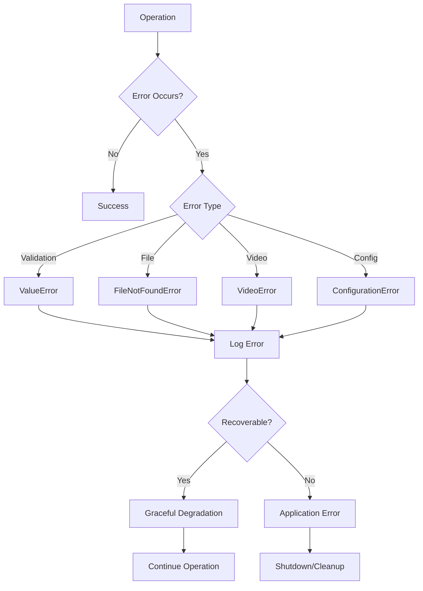
```mermaid
flowchart TD
    A[Operation] --> B{Error Occurs?}
    B -->|No| C[Success]
    B -->|Yes| D{Error Type}

    D -->|Validation| E[ValueError]
    D -->|File| F[FileNotFoundError]
    D -->|Video| G[VideoError]
    D -->|Config| H[ConfigurationError]

    E --> I[Log Error]
    F --> I
    G --> I
    H --> I

    I --> J{Recoverable?}
    J -->|Yes| K[Graceful Degradation]
    J -->|No| L[Application Error]

    K --> M[Continue Operation]
    L --> N[Shutdown/Cleanup]
```

## Performance Optimization

### Frame Caching Strategy

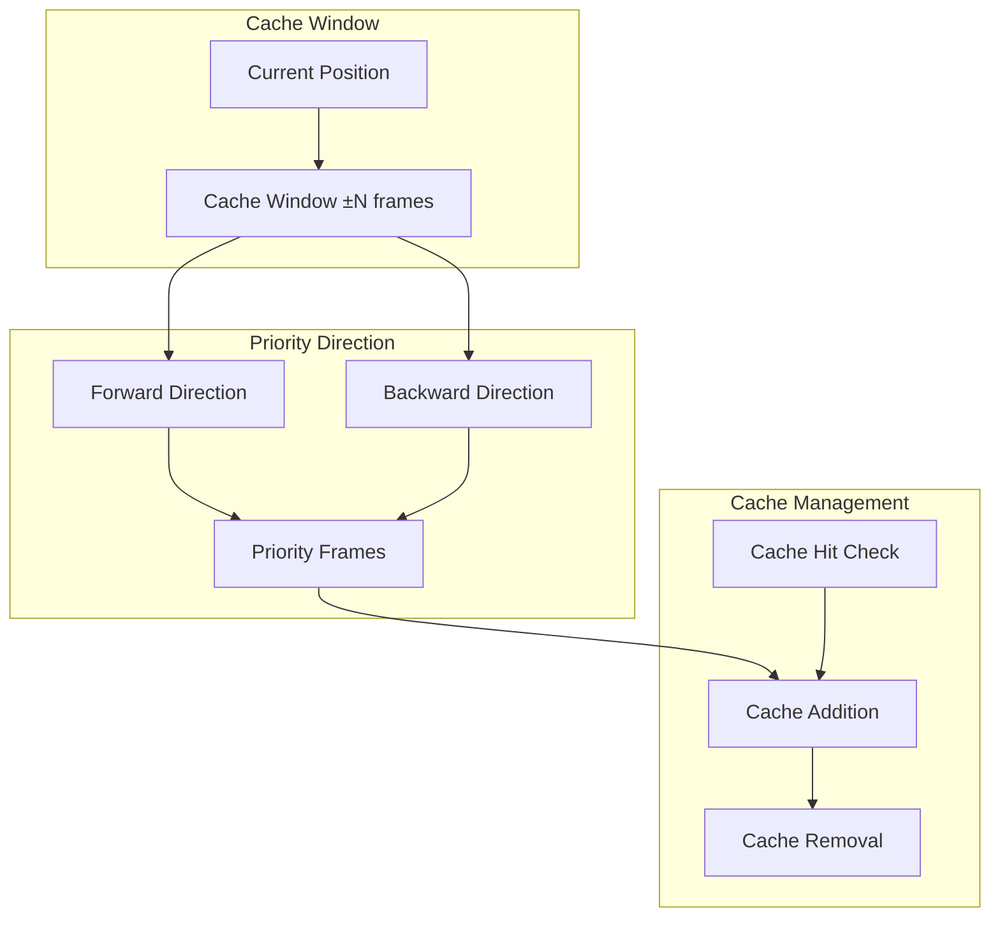
```mermaid
graph TD
    subgraph "Cache Window"
        CP[Current Position]
        CW[Cache Window ±N frames]
    end

    subgraph "Priority Direction"
        FD[Forward Direction]
        BD[Backward Direction]
        FP[Priority Frames]
    end

    subgraph "Cache Management"
        CA[Cache Addition]
        CR[Cache Removal]
        CH[Cache Hit Check]
    end

    CP --> CW
    CW --> FD
    CW --> BD
    FD --> FP
    BD --> FP
    FP --> CA
    CA --> CR
    CH --> CA
```

### Memory Management

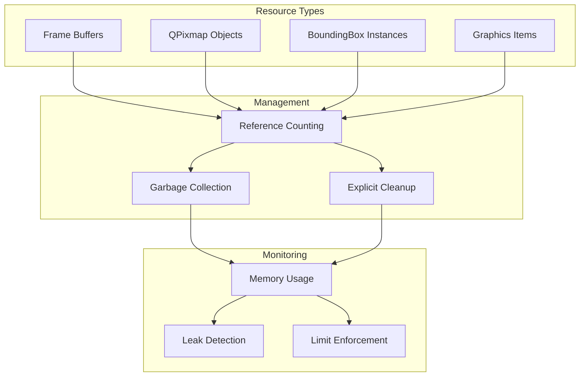
```mermaid
graph TD
    subgraph "Resource Types"
        FR[Frame Buffers]
        PX[QPixmap Objects]
        BB[BoundingBox Instances]
        GI[Graphics Items]
    end

    subgraph "Management"
        RC[Reference Counting]
        GC[Garbage Collection]
        CL[Explicit Cleanup]
    end

    subgraph "Monitoring"
        MU[Memory Usage]
        LR[Leak Detection]
        LM[Limit Enforcement]
    end

    FR --> RC
    PX --> RC
    BB --> RC
    GI --> RC

    RC --> GC
    RC --> CL

    GC --> MU
    CL --> MU
    MU --> LR
    MU --> LM
```

## Integration Points

### With eNuts Ecosystem

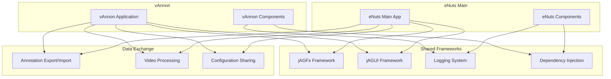
```mermaid
graph TD
    subgraph "vAnnon"
        VA[vAnnon Application]
        VTC[vAnnon Components]
    end

    subgraph "Shared Frameworks"
        JFX[jAGFx Framework]
        JGUI[jAGUI Framework]
        LOG[Logging System]
        DI[Dependency Injection]
    end

    subgraph "eNuts Main"
        EM[eNuts Main App]
        ETC[eNuts Components]
    end

    subgraph "Data Exchange"
        DX[Annotation Export/Import]
        VP[Video Processing]
        CF[Configuration Sharing]
    end

    VA --> JFX
    VA --> JGUI
    VTC --> LOG
    VTC --> DI

    EM --> JFX
    EM --> JGUI
    ETC --> LOG
    ETC --> DI

    VA --> DX
    EM --> DX
    VA --> VP
    EM --> VP
    VA --> CF
    EM --> CF
```

### External Tool Integration

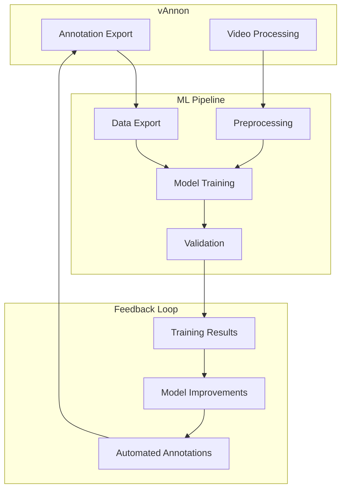
```mermaid
graph TD
    subgraph "vAnnon"
        ANN[Annotation Export]
        VID[Video Processing]
    end

    subgraph "ML Pipeline"
        EXP[Data Export]
        PRE[Preprocessing]
        TRA[Model Training]
        VAL[Validation]
    end

    subgraph "Feedback Loop"
        RES[Training Results]
        IMP[Model Improvements]
        AUTO[Automated Annotations]
    end

    ANN --> EXP
    VID --> PRE
    EXP --> TRA
    PRE --> TRA
    TRA --> VAL
    VAL --> RES
    RES --> IMP
    IMP --> AUTO
    AUTO --> ANN
```

## Future Extensions

### Batch Processing Architecture

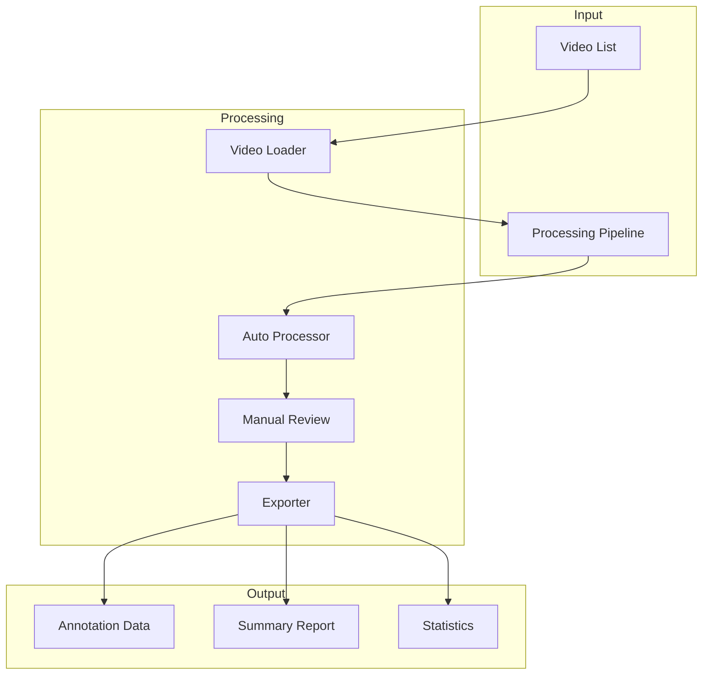
```mermaid
graph TD
    subgraph "Input"
        VL[Video List]
        PL[Processing Pipeline]
    end

    subgraph "Processing"
        LD[Video Loader]
        AP[Auto Processor]
        MR[Manual Review]
        EX[Exporter]
    end

    subgraph "Output"
        AD[Annotation Data]
        SR[Summary Report]
        ST[Statistics]
    end

    VL --> LD
    LD --> PL
    PL --> AP
    AP --> MR
    MR --> EX
    EX --> AD
    EX --> SR
    EX --> ST
```

### Collaborative Features

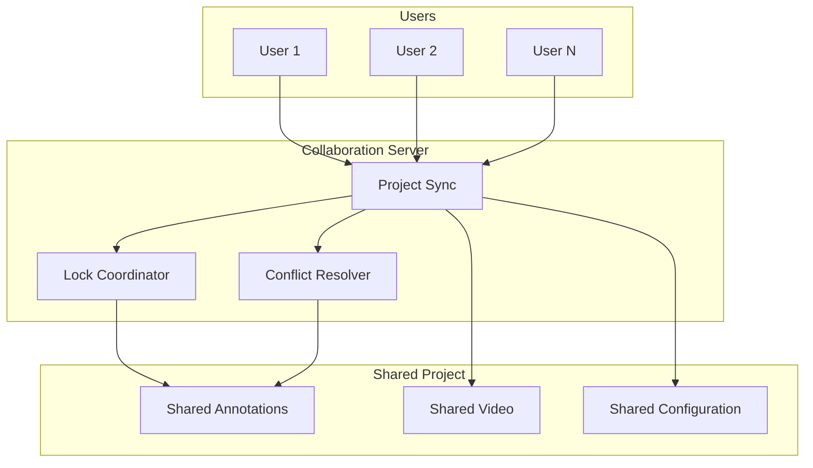
```mermaid
graph TD
    subgraph "Users"
        U1[User 1]
        U2[User 2]
        Un[User N]
    end

    subgraph "Collaboration Server"
        PS[Project Sync]
        LC[Lock Coordinator]
        CR[Conflict Resolver]
    end

    subgraph "Shared Project"
        SP[Shared Annotations]
        SV[Shared Video]
        SC[Shared Configuration]
    end

    U1 --> PS
    U2 --> PS
    Un --> PS

    PS --> LC
    PS --> CR

    LC --> SP
    CR --> SP
    PS --> SV
    PS --> SC
```

## Deployment Architecture

### Development Environment

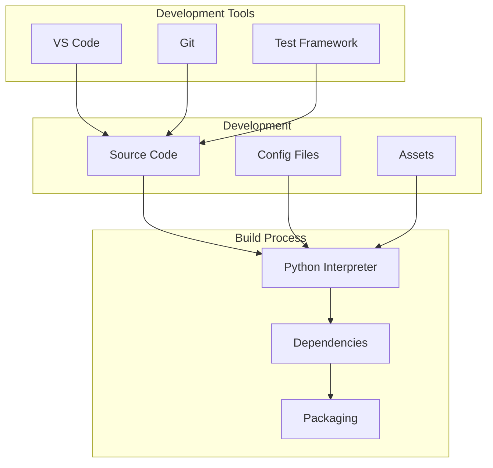
```mermaid
graph TD
    subgraph "Development"
        SRC[Source Code]
        CFG[Config Files]
        AST[Assets]
    end

    subgraph "Build Process"
        PY[Python Interpreter]
        DEP[Dependencies]
        PKG[Packaging]
    end

    subgraph "Development Tools"
        IDE[VS Code]
        GIT[Git]
        TST[Test Framework]
    end

    SRC --> PY
    CFG --> PY
    AST --> PY

    PY --> DEP
    DEP --> PKG

    IDE --> SRC
    GIT --> SRC
    TST --> SRC
```

### Production Deployment

```mermaid
graph TD
    subgraph "Application Package"
        EXE[Executable]
        CFG[Configuration]
        AST[Assets]
        DEP[Dependencies]
    end

    subgraph "Runtime Environment"
        OS[Operating System]
        QT[Qt Libraries]
        CV[OpenCV]
        PY[Python Runtime]
    end

    subgraph "Data"
        VD[Video Files]
        AD[Annotation Data]
        LOG[Log Files]
    end

    EXE --> OS
    CFG --> OS
    AST --> OS
    DEP --> OS

    OS --> QT
    OS --> CV
    OS --> PY

    VD --> EXE
    EXE --> AD
    EXE --> LOG
