# vAnnon Workflows and Data Flow

## Core Workflows

### 1. Application Startup

```mermaid
flowchart TD
    A[main.py] --> B[loadConfig()]
    B --> C[Set Windows taskbar icon]
    C --> D[Create QApplication]
    D --> E[Load fonts and QSS]
    E --> F[Create MainWindow]
    F --> G[Show window]
    G --> H[Start event loop]
```

**Key Steps**:
1. Load configuration from JSON
2. Configure platform-specific settings (Windows taskbar)
3. Initialize Qt application
4. Load UI resources (fonts, stylesheets)
5. Create and display main window
6. Enter Qt event loop

### 2. Video Loading Workflow

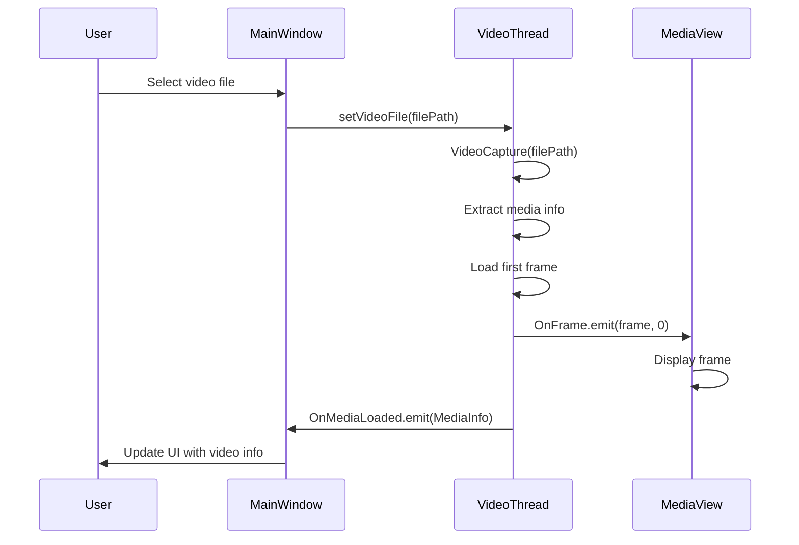

**Error Handling**:
- File not found → Exception with descriptive message
- Unsupported format → VideoCapture fails gracefully
- Corrupted file → OpenCV error handling

### 3. Annotation Creation Workflow

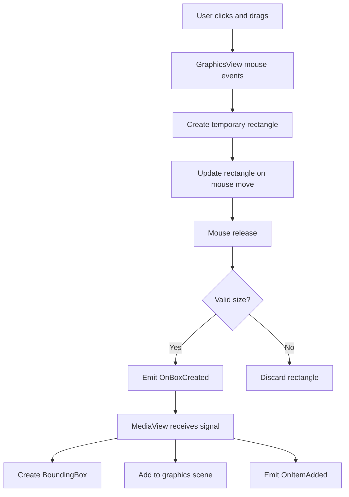

**Validation Rules**:
- Minimum size: 5x5 pixels
- Must be within frame boundaries
- Snapping to content (future enhancement)

### 4. Playback Control Workflow

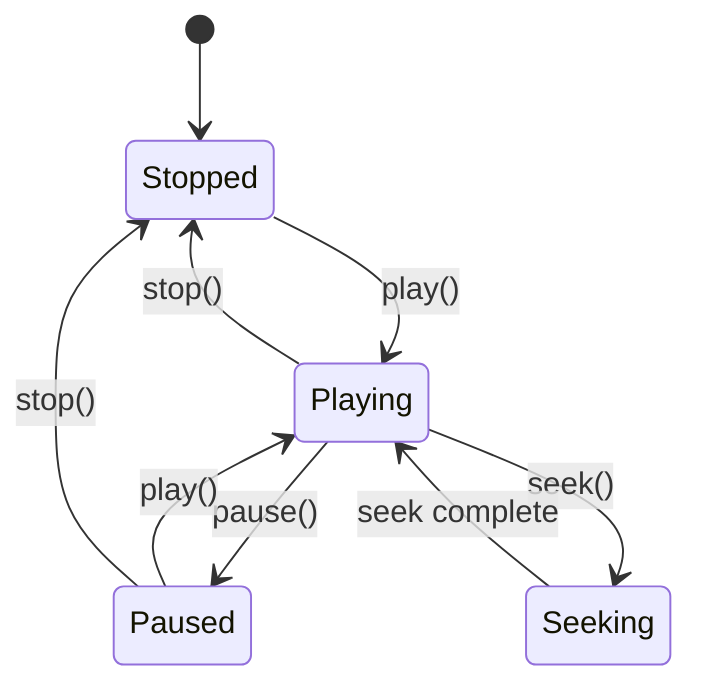

**State Transitions**:
- **Stopped → Playing**: Start from beginning or current position
- **Playing → Paused**: Freeze current frame
- **Paused → Playing**: Resume from current position
- **Any → Stopped**: Reset to beginning
- **Seeking**: Asynchronous seek operation

## Data Flow Patterns

### Frame Processing Pipeline

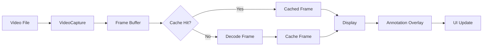

### Annotation Data Flow

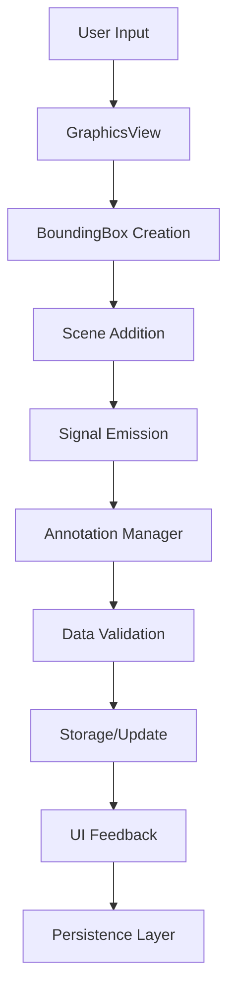

## Detailed Component Interactions

### VideoThread Internal Flow

1. **Initialization**:
   - Create VideoCapture instance
   - Extract MediaInfo (FPS, frame count, resolution)
   - Initialize caching system
   - Start background thread

2. **Frame Serving Loop**:
    ```python
    while running:
        if seeking:
            frame = getFrame(seekPosition)
            emit OnFrame(frame, position)
            seeking = False
        elif playing:
            frame = getFrame(nextPosition)
            emit OnFrame(frame, position)
            updateNextPosition()

            # Precise timing with target timestamps
            if targetFrameTime == 0.0:
                targetFrameTime = monotonic()
            frameInterval = mediaInfo.getEstimatedDelay(playbackSpeed)
            targetFrameTime += frameInterval
            sleepDuration = max(0.0, targetFrameTime - monotonic())
            sleep(sleepDuration)
    ```

3. **Caching Logic**:
   - Monitor playback direction
   - Cache frames in priority order
   - Clean up distant frames
   - Track performance metrics

### MediaView Event Handling

1. **Frame Reception**:
   - Clear existing annotations
   - Update current frame index
   - Convert frame to QPixmap
   - Fit view to maintain aspect ratio

2. **Annotation Management**:
   - Track annotations per frame
   - Handle selection and editing
   - Coordinate with graphics scene

3. **User Interaction**:
   - Mouse events for drawing
   - Keyboard shortcuts for operations
   - Context menu for advanced actions

### Tag System Data Flow

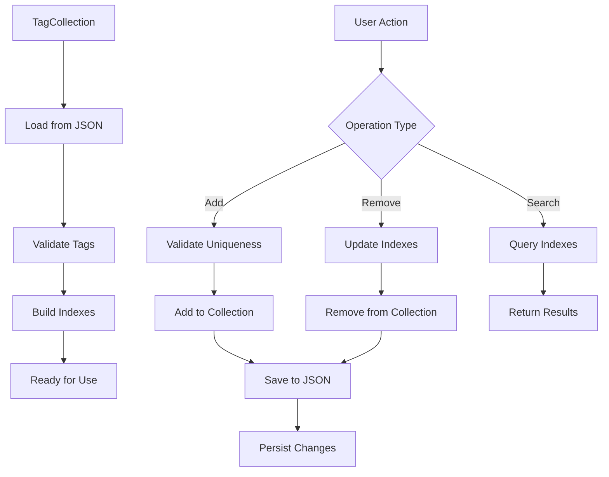

## Configuration Workflow

### Application Configuration Loading

```mermaid
flowchart TD
    A[Application Start] --> B[LoadCFG()]
    B --> C[Read JSON file]
    C --> D[Parse configuration]
    D --> E[Create vAnnonConfiguration]
    E --> F[Register with Provider]
    F --> G[Available for injection]
```

### Runtime Configuration Updates

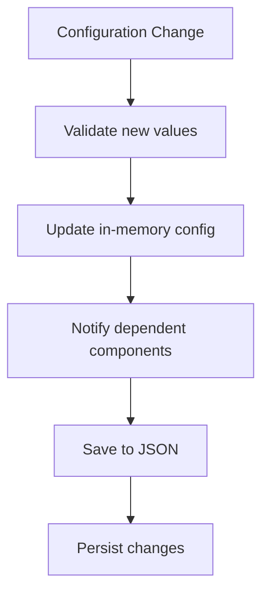

## Error Handling and Recovery

### Video Loading Errors

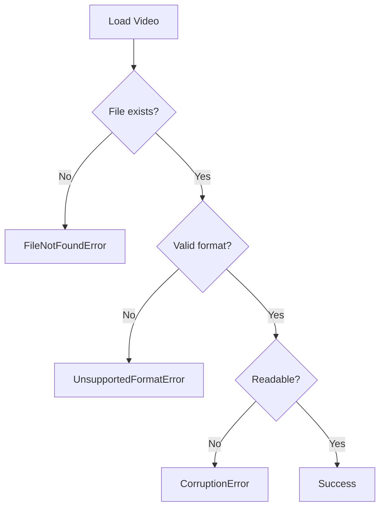

### Annotation Errors

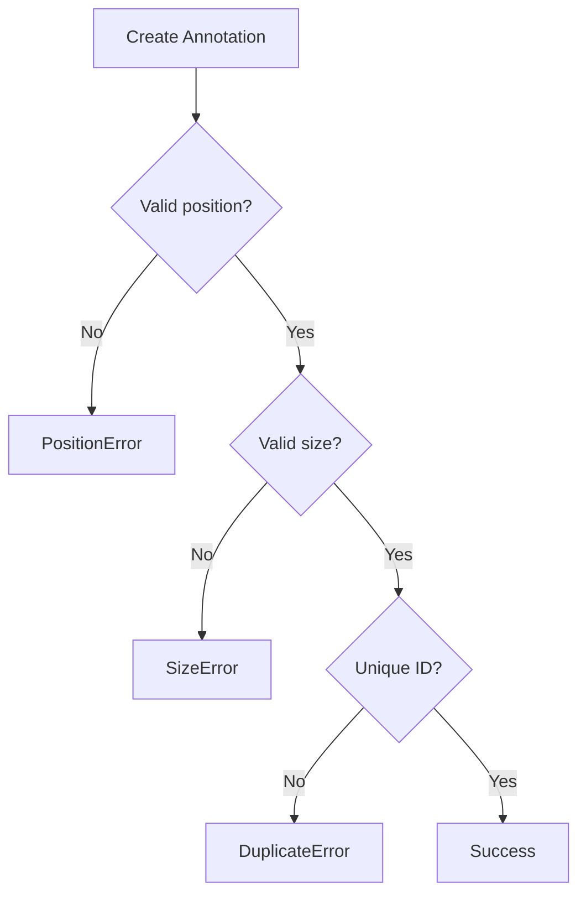

## Performance Optimization Workflows

### Frame Caching Strategy

1. **Cache Window Calculation**:
   - Current position ± (cache_duration × FPS / 2)
   - Adjust for playback direction
   - Respect memory limits

2. **Cache Maintenance**:
   - Remove frames outside window
   - Prioritize frequently accessed frames
   - Monitor cache hit rates

3. **Adaptive Caching**:
   - Track seek patterns
   - Adjust cache size based on usage
   - Balance memory vs performance

### UI Responsiveness

1. **Thread Separation**:
   - Video processing in background thread
   - UI updates on main thread
   - Signal-based communication

2. **Lazy Loading**:
   - Load components on demand
   - Cache UI elements
   - Minimize redraws

3. **Efficient Rendering**:
   - Use QPixmap for frame display
   - Minimize graphics item updates
   - Batch UI operations

## Data Export Workflows

### Annotation Export

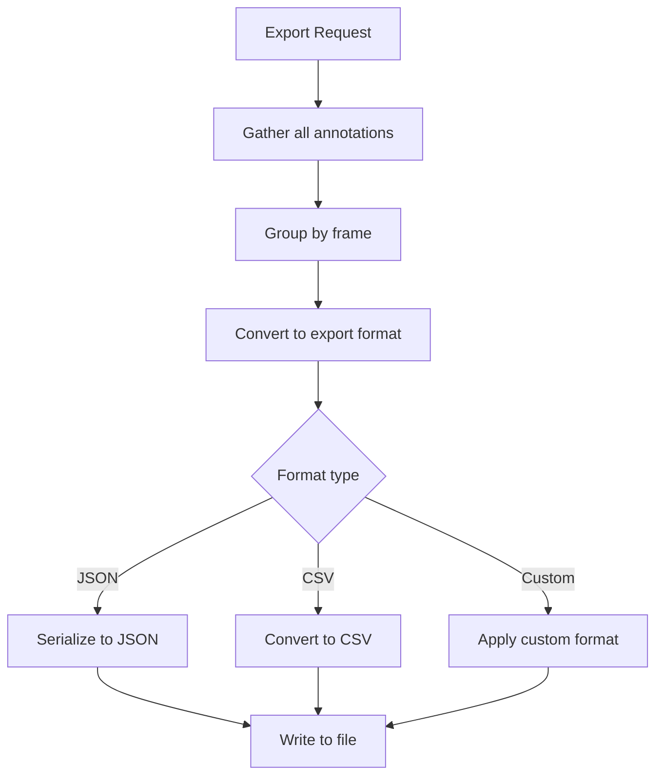

### Tag Export

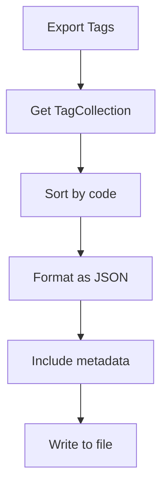

## Integration Workflows

### With eNuts Ecosystem

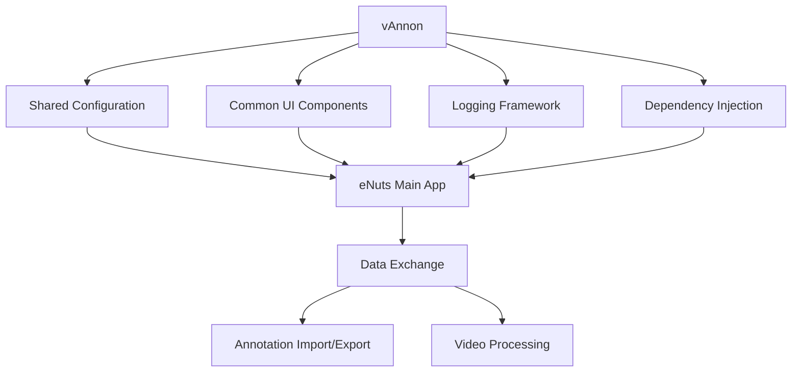

### External Tool Integration

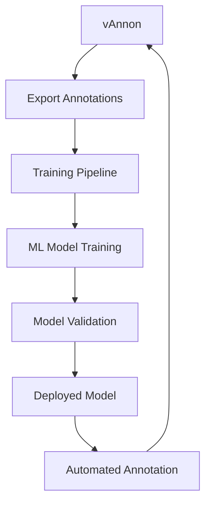

## Lifecycle Management

### Component Initialization

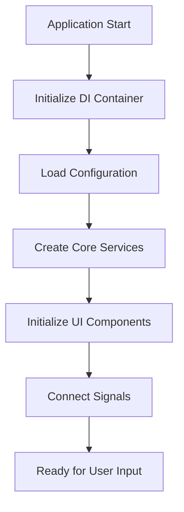

### Component Shutdown

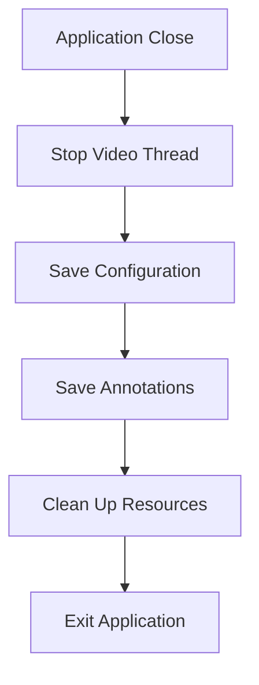

### Memory Management

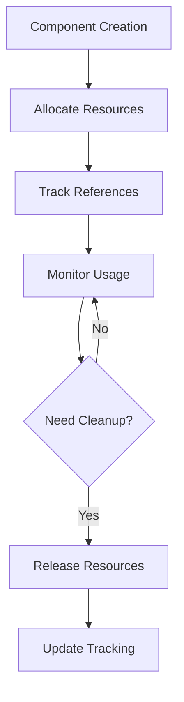

## Future Workflow Extensions

### Batch Processing

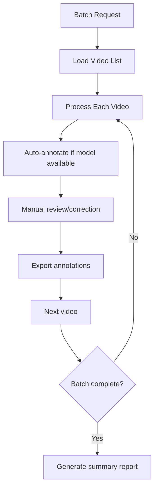

### Collaborative Annotation

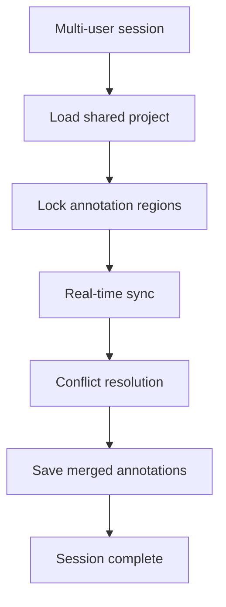

### Automated Assistance

```mermaid
flowchart TD
    A[Frame loaded] --> B[Run detection model]
    B --> C[Generate proposals]
    C --> D[Present to user]
    D --> E[User accepts/rejects/edits]
    E --> F[Update training data]
    F --> G[Model improvement]
